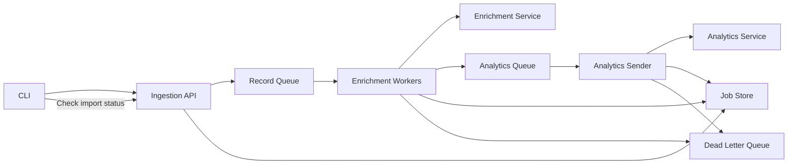
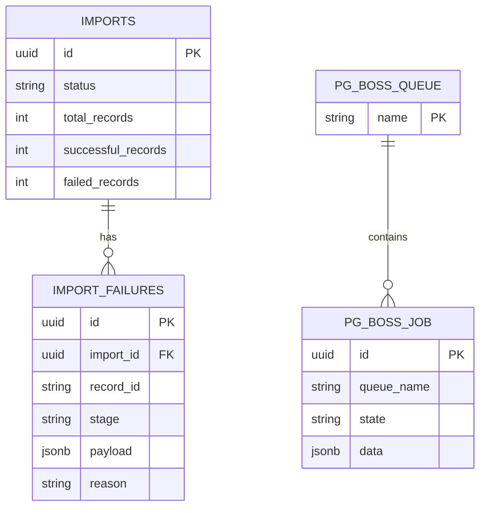

## Context

The following observations and assumptions guided this design:

- The system is deemed mission-critical.
- The analytics service is slow. The example workload takes 8+ minutes to complete due to rate-limiting.
- **Assumption**: The example workload (1.000 rows / upload) is representative. We don't expect millions or billions of events per import.
- **Assumption**: The analytics service de-duplicates events. We can send the same event (by id) twice.
- **Assumption**: Record ordering does not have to be preserved.
- **Assumption**: Event IDs are locally unique, but not globally unique over time. They are integers that can wrap and be reused for different events later.

## Decision

### Project structure

- The repo shall be structured as monorepo containing the `cli` and `api` as separate workspaces.
- The monorepo shall contain a `contracts` package that holds shared schemas and types to keep core data schemas in sync between `api` and `cli`.

### API

- The API shall be a stateful, **asynchronous** service.
  - Given the high processing times, it does not make sense that the CLI keeps a socket open and waits for processing to complete, so a synchronous design does not hold up.
- The API shall use CSV as the accepted wire format for uploads as it is streamable and matches the CLI-supported format.
- The API shall return a `job_id` for a successfully submitted workload that can be used to poll for processing state.
- The API should parse provided data at the service boundary and fail fast on encountering invalid data.
- The API shall not trust submitted data and verify it.
- The API shall only store permanent records for processed jobs and processing failures; successfully processed records do not need to be stored as they are available via the analytics service.

- Processing shall be implemented via worker queues and implement bounded retries.
- The enrichment queue shall run with limited concurrency.
- The analytics queue shall use a rate limiter internally.
- The load is small enough that we can run this with a Postgres-based queuing solution (pgmq, pg-boss) and do not need an external piece of infrastructure such as Kafka or RabbitMQ. This has a key advantage that the job record and all related jobs can be created in an atomic transaction, which allows for easy service recoverability and offers atomicity guarantese.

See the following diagram for a high-level overview of the processing flow:

The following high-level database schema is proposed:

### CLI

- The CLI shall parse and filter data locally before submitting it to the API to cut down on network and service load.
- The CLI shall have the following command surface:
  - `cli upload logs.csv [--no-wait] [--filter] <csv_file>`
  - `cli status <job_id>`
- By default, the CLI's `upload` command shall display the acquired job id to the user and then poll for progress updates automatically. The `--no-wait` flag can be set to exit after job id is shown.
- The `status` command may be used to look up the processing status of any submitted job.
